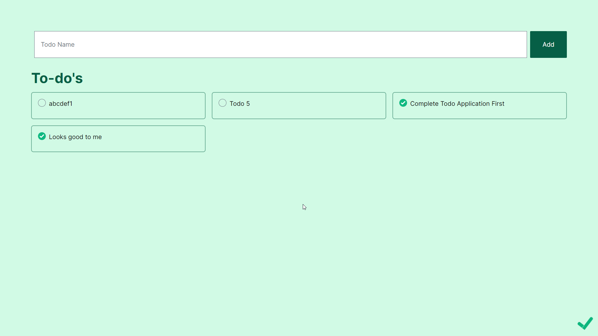
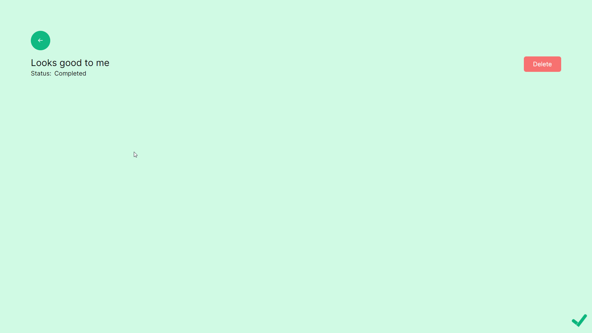

# Todo-Demo-App ✅
> Build using NextJS-13 and PocketbaseDB


This project is built as a learning step towards becoming the perfect NextJS Developer. Feel free to checkout the source code and learn the core essential basics of NextJS.

- If you are a beginner, this repository will answer a lot of your questions. 

- If you feel the codebase could be improved. Feel free to contribute in the codebase while learning new things. 


## Concepts Included 🐱‍🚀

- API Handlers & Dynamic Routes
- Validing request body using [ZOD](https://www.npmjs.com/package/zod)
- Folder Based Routing/Navigation
- Utilizing PocketbaseDB sorting and filtering
- Different Predefined Files
- Learned how to create client component
- Using custom titile icon

## Run the application ```▶```

```shell
# Start the pocketbase DB
pocketbase serve

# Install all the dependencies
npm install

# Open another terminal to start Next App
npm run dev
```

## Folder Structure 🦴
```
...
 ├──app/
   ├── _components/   # Non-Routable (contains components)
   ├── _models/   # Non-Routable (contains object models)
   ├── _utils/   # Non-Routable (contains DB utils)
   ├── api/   # Contains API Handlers
    ├── [id]/   # Dynamic API Handler for `/api/[id]`
   ├── page.tsx # Routable (Todo Home Page)
   ├── todo/[id]/page.tsx # Routable (Dynamic [id], Todo Detail Page)
   └── layout.tsx # Root Layout (used across complete application)
```

## Resources 📂
- Repo: [My NextJS Notes](https://github.com/AmanNegi/Notes/blob/main/NextJs/README.md)
- Blog: [Routes in new App Router](https://www.builder.io/blog/next-13-app-router)
- Repo: Want [another perfect codebase](https://github.com/sadmann7/skateshop)? not mine 🙈
## Screenshots 💻

 
  

## Support 🤝

This project needs a ⭐️ from you. Don't forget to leave a star.